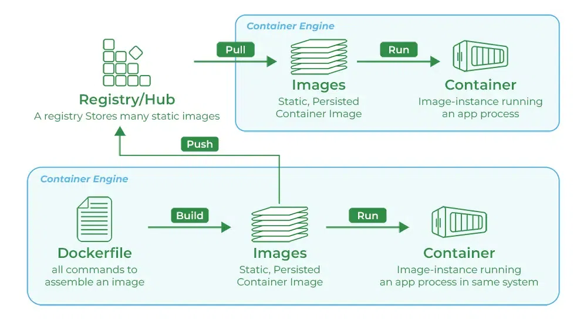

# **Introduction to Docker**

## **What is Docker?**
Docker is a platform designed to help developers build, share, and run container applications.

Example: Imagine you go to buy Maggi noodles. It comes with a spice mix inside the packet. You cook it, and it tastes a certain way. Now, if you go to your friend's house and eat the same Maggi, it will taste the same, because the spice mix is the same.

But now, imagine if the Maggi company says, “We’ll give you the recipe for the spice mix, and you make it yourself.” Even though you try to follow the recipe exactly, the taste might still be different, because of small differences in ingredients, proportions, or how you mix them.

So, even if the noodle packet is the same, the taste can vary based on how the spice mix was made. That’s why having the pre-made spice mix ensures consistency.

This is exactly how Docker works.

In software development, Docker acts like that pre-packed container with everything already set up — just like the Maggi with the spice mix inside. It includes your project along with all the required configurations and dependencies. So instead of reading long setup documentation or manually installing everything every time, you just "cut open the packet" install and run it, and it works the same everywhere.

## **Why do we need dockers?**
- **Consistency Across Environments**
    - **Problem:** Applications often behave differently in development, testing, and production environments due to variations in configurations, dependencies, and infrastructure.
    - **Solution:** Docker containers encapsulate all the necessary components, ensuring the application runs consistently across all environments.

- **Isolation**
    - **Problem:** Running multiple applications on the same host can lead to conflicts such as: dependency clashes or resource contention
    - **Solution:** Docker provides isolated environments for each application, preventing interference and ensuring stable performance.

    [For isolation we can use the Virtual Machines, however those are too heavy because they include OS also. Where as the docker contains only the environment files and the project files.]

- **Scalability:**
    - **Problem:** Scaling applications to handle increased load can be challenging, requiring manual intervention and configuration
    - **Solution:** Docker makes it easy to scale application horizontally by running multiple container instances, allowing for quick and efficient scaling.

    [For scalability, we run our project on different servers or different machines. Suppose, in noon the users of uber eats are low so you are running the app on 3 servers however in night there are lots of customers then you need to add 2-3 more servers additionally. Thus, for the scalability we need to sue the docker. Containerize it and run on different machines or servers.]

## **How exactly Docker is used?**
